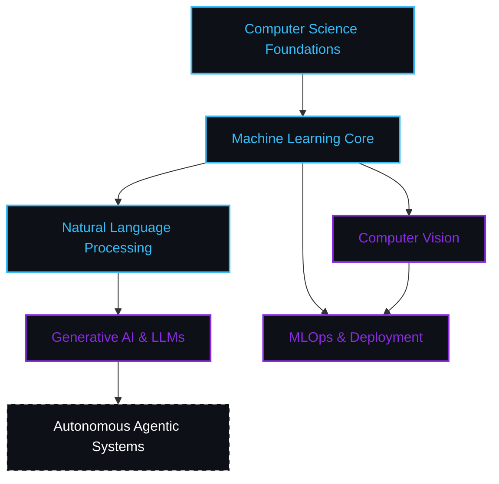

# 
Hi, I'm Kailas 👋

  

---

### 
🧠 Machine Learning Technical Tree

---

### 
🛠️ Layered System Architecture

| **Layer** | **Technologies** |
| :--- | :--- |
| **🧠 Modeling & DL** |  |
| **🌐 Interface & Logic** |  |
| **⚡ Core Infra** |  |

---

### 
📊 Activity Matrix

  

  
  

---

### 
📫 Connect with Me

  
  

